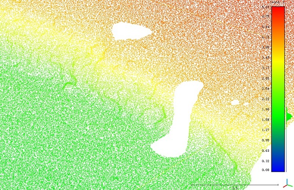
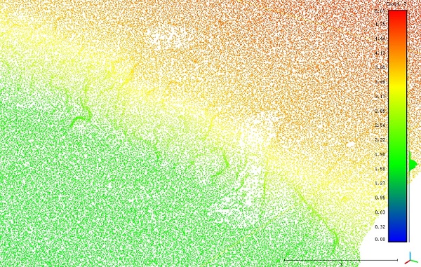
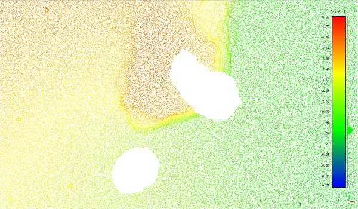
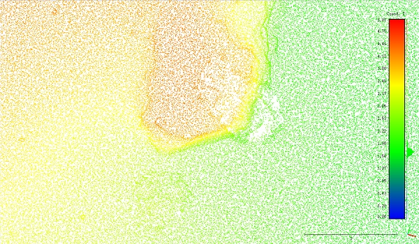

# PCI
A method of point cloud inpainting by decomposing the representation of point cloud into low frequency signal and high frequency signal.  
The low frequency signal is constructed by fitting point clouds to nurbs using point-distance-minimization which is always complete, while the high frequency signal is constructed by distances from discrete points to nurbs which needs to be inpainted somewhere called hole.

# Contribution
- a complete pipeline to inpaint point clouds using nurbs and image inpainting tech.
- a method to define holes and detect holes automatically.
- haven't decided yet, hhh \_(:з」∠)\_

# Experiment Result
### Rock Wall

# Info
still developing...
